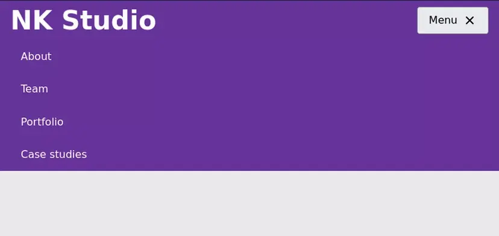

## How most hidden Menus work

Most hidden menus work by using JavaScript to change the styles or toggle a class to show or hide a bunch of links.

```css
    .menu-list {
    //hide menu
    }
    
    .menu--is-open .menu-list {
    // show menu
    }
    
```
I've created a [basic nav menu on codepen](https://codepen.io/nirjan_dev/pen/jOmbgxJ). You can use that to follow along with this post.



Semantic HTML
-------------

Using good semantic HTML is essential to creating accessible sites. In my example, I've wrapped the links in an unordered list. So, the screen reader can know how many links are there in the list.

I've wrapped the list in a [nav tag](https://developer.mozilla.org/en-US/docs/Web/HTML/Element/nav). I've then wrapped the nav tag in a [header tag](https://developer.mozilla.org/en-US/docs/Web/HTML/Element/header). I'm also using a button to toggle the menu and not a span or a div. So, the user can focus on it by tabbing and use the button with just the keyboard. The menu button shouldn't be a link either because it won't link to anything.

You should always try to find the correct HTML tag for your use-case, instead of just using divs or spans everywhere. [The elements reference page on MDN](https://developer.mozilla.org/en-US/docs/Web/HTML/Element) is great for researching what tags to use where.
```html
    <header class="main-header">
      <a class="brand-logo" href="/">NK Studio</a>
     
      <nav class="main-nav" id="primary-nav">
        <button class="menu-btn">
          Menu
          <i class="gg-menu menu-btn__icon"></i>
        </button>
        <ul class="main-nav__list">
          <li class="main-nav__list-item">
            <a class="main-nav__link" href="#about">About</a>
          </li>
          <li class="main-nav__list-item">
            <a class="main-nav__link" href="#team">Team</a>
          </li>
          <li class="main-nav__list-item">
            <a class="main-nav__link"href="#portfolio">Portfolio</a>
          </li>
          <li class="main-nav__list-item">
            <a class="main-nav__link" href="#case-studies">Case studies</a>
          </li>
        </ul>  
      </nav>
    </header>
```
> Note: I'm placing the Menu button inside the nav tag. This is to ensure that the people who move to the nav tag using a shortcut won't just find a hidden list. They'll find the button to open the nav menu. You should also make sure that the focus order makes sense. Here the next item that is focusable after the menu button is the first link in the menu.

## Hiding the menu

You need to make sure that the hidden menu is not accessible without opening it. You should use the display or visibility property to hide the menu. This makes sure that the hidden menu isn't focused when tabbing and aren't read by screen readers.

Be careful if you're only using transforms, width, opacity or any other similar properties to hide the menu. Screen readers can still access them, and users can reach them by tabbing. So, you need to use the [display](https://developer.mozilla.org/en-US/docs/Web/CSS/display) or [visibility](https://developer.mozilla.org/en-US/docs/Web/CSS/visibility) property to hide the menu.

In this example, I'm using a high negative transformY value to hide the menu. So I need to use the visibility property to make sure the hidden nav is not accessible without opening it. You could also use the display property, but it can be bad for performance.
```css
    .main-nav__list{
      // other styles
    
      transform: translateY(-999px);
      visibility: hidden;
    }
      
      
    .main-nav--is-open .main-nav__list {
      transform: translateY(0);
      visibility: visible;
    }
    
```
## Communicating Menu States

The next thing you need to do is make sure all the users of your site are aware of the menu's open and closed states. This is simple for sighted users as they can just see the menu open and close, but you also need to make sure any users with visual impairments can tell the current state of the menu.

We need to add an aria-expanded attribute to the button. This informs the user about the current state of the button and lets them know we can open the menu using the button. We need to change the value of aria-expanded to true when it's open and to false when it's closed.
```html
    <button class="menu-btn" aria-expanded="false">
      Menu
      <i class="gg-menu menu-btn__icon"></i>
    </button>
```

```js
    function toggleAriaExpanded() {
      const isExpanded = menuBtn.getAttribute('aria-expanded') === 'true';
      
      let newState;
      if (isExpanded) {
        newState = false;
      } else {
        newState = true;
      }
      menuBtn.setAttribute('aria-expanded', newState);
    }
    
```
Adding Aria-controls
--------------------

The [aria-controls attribute](https://tink.uk/using-the-aria-controls-attribute/) helps screen reader users navigate from a controlling element to a controlled element. But, it is only supported in the JAWS screen reader. So you simply can’t rely on it.

The aria-controls attribute is still a nice to have feature for JAWS users and since it doesn't do much harm, we can choose to add it to our menu.

We just need to add it to the menu button and set the value to the value of the ID for the menu.
```html
    <button class="menu-btn" aria-expanded="false" aria-controls="nav-list">
      Menu
      <i class="gg-menu menu-btn__icon"></i>
    </button>
    <ul class="main-nav__list" id="nav-list">
```
Where to go from here
---------------------

If you follow all the tips mentioned in this post, then you should have a more accessible nav menu for your site. Make sure to test this using an actual screen reader.

There are other types of menus that aren't used for site navigation. Instead, they're used for choosing options in an app. Take a look at Heydon Pickering's [excellent guide to building inclusive menus](https://inclusive-components.design/menus-menu-buttons/).

If you're using a hover menu, then it might be a good time to switch to click menus, as mentioned in [this post on csstricks.](https://css-tricks.com/in-praise-of-the-unambiguous-click-menu/)

