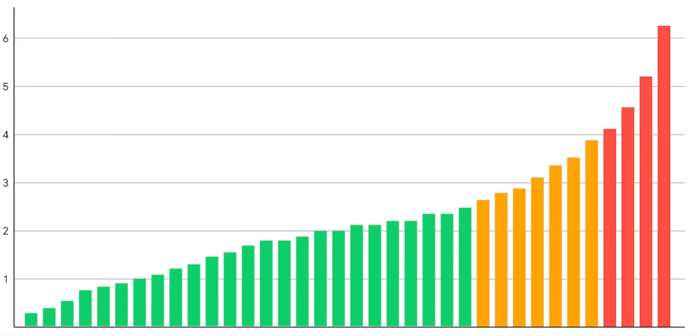
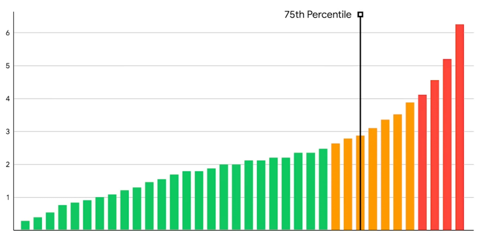
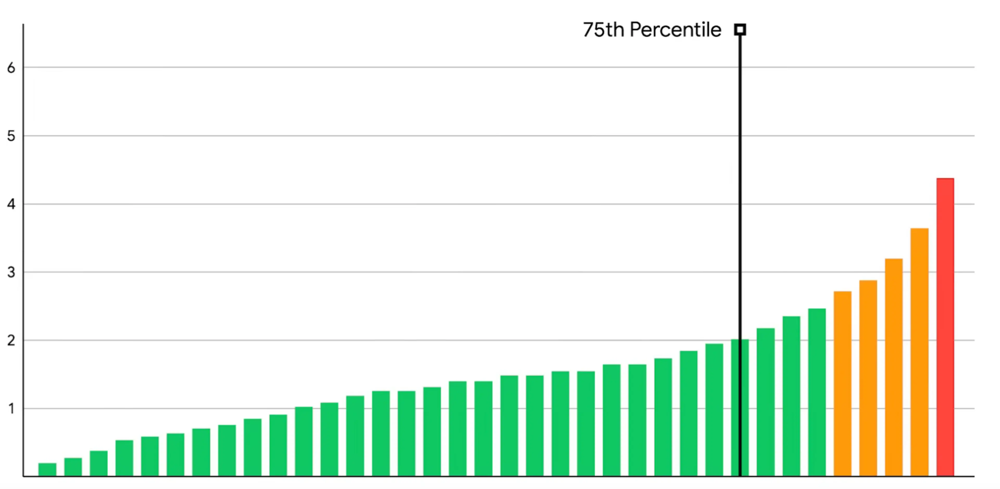

First, let’s briefly discuss what Core Web Vitals are and how do they impact your site.

> Core Web Vitals are page load metrics that measure 3 different aspects of how users experience your site.

Core Web Vitals consists of three metrics:

1.  **Largest Contentful Paint (LCP)**: Measures how quickly the main content loads.
2.  **Cumulative Layout Shift (CLS):** Measures how stable the layout of the page is.
3.  **First Input Delay (FID):** Measures how quickly the site responds to user input.

Google uses the **Core Web Vitals (CWV)** assessment as part of it’s ranking algorithm. So, If your site depends on SEO, then improving CWV can result in more organic traffic. A faster site is also a lot better for your users. Then, there are [plenty of other business reasons](https://web.dev/vitals-business-impact/) as well to improve CWV.

To pass the CWV assessment, you must hit the following targets for all three metrics, for at least 75% of page visits:

*   LCP should be less than 2.5 seconds
*   FID should be less than 100 milliseconds
*   CLS should be less than 0.1

Since you need to pass CWV for at least 75% of page visits, you need to improve your site's experience for all users.

For instance, suppose we have a website with 36 visitors. We can sort their Core Web Vitals (CWV) experience from best to worse. The green bars are good CWV, yellow bars need improvements, and red bars are poor CWV.



The 75th percentile for this would be the 26th bar (75% of 36), which is in the needs improvements range. So, this site would fail the CWV assessment.



If we make improvements to speed up the site for visitors that are already getting good CWV then it still won’t pass.The same thing happens when we only make improvements for people getting the poorest CWV.To pass the CWV assessment, you need to make changes that will impact most of your users.



How to measure Core Web Vitals
------------------------------

Before we learn how to improve Core Web Vitals for your site, we need to know how to measure it. You need to have some way of measuring CWV before you start making changes. This will allow you to actually see the impact of your changes. There are two ways to measure CWV.

### How to measure Core Web Vitals with Lab data

This is the easiest way to measure Core Web Vitals. This is the easiest way to measure Core Web Vitals. You can use tools like [Lighthouse](https://developer.chrome.com/docs/lighthouse/overview/) and [WebPageTest](https://www.webpagetest.org/) to measure it locally, on staging and on production.

> [Lab data](https://web.dev/user-centric-performance-metrics/#in-the-lab), also known as synthetic data, is collected from a controlled environment, rather than actual users.

You can even use [Lighthouse CI](https://github.com/GoogleChrome/lighthouse-ci) to add it to your CI/CD pipelines. This is a good way to get started and build a performance-centric culture in your team. But, since Google will use the metrics from your actual users (that use Chrome), you should have some way to get that data too.

### How to measure Core Web Vitals with RUM

RUM stands for Real User Metrics, and it’s the best way to track Core Web Vitals. There are lots of services that will track your site’s RUM performance for you. Popular services include [Speedcurve](https://speedcurve.com/), [Sentry](https://sentry.io), [Cloudflare Analytics](https://developers.cloudflare.com/analytics/web-analytics/getting-started/), [Cronitor](https://cronitor.io/), [New Relic](https://newrelic.com/) and [Dynatrace](https://www.dynatrace.com/).

If you want to track RUM performance on your own then you can use the [web-vitals JavaScript library](https://github.com/GoogleChrome/web-vitals). With this library, you can send the metrics to any API that you want. If you have Google Analytics then you can use this to [send the data to Google Analytics](https://github.com/GoogleChrome/web-vitals/#send-the-results-to-google-analytics). Then, you can [visualize your RUM data in Google Analytics using this tool](https://github.com/GoogleChrome/web-vitals/#send-the-results-to-google-analytics). If you use BigQuery or Looker Studio then you can use them to [create a RUM performance dashboard](https://web.dev/vitals-ga4/).

### How to check CWV using Google’s Tools

You can also use some tools by Google to check your RUM performance. These tools all use the [data from chrome users visiting your site.](https://developer.chrome.com/docs/crux/)

*   **CrUX dashboard**: You can use this pre-built [CrUX dashboard](https://developers.google.com/web/updates/2018/08/chrome-ux-report-dashboard). It uses a Looker Studio template to visualize your data.
*   **Search Console:** You can use [Google Search Console](https://search.google.com/search-console/welcome) to view the CWV data on a per-page basis for the sites that you own.
*   **PageSpeed Insights (PSI)**: You can use [the PSI tool](https://pagespeed.web.dev/) to analyze page level and site level metrics. It will show you both the RUM scores and run a lighthouse test for you. You can also use the [PSI API to automate the testing of your pages.](https://developers.google.com/speed/docs/insights/v5/get-started)

How to keep track of your Core Web Vitals
-----------------------------------------

Once you have a Lab and RUM tracking system in place, you should keep monitoring your Core Web Vitals. It is especially important to check them after a release to avoid any regressions. You can also setup alerts when you get performance issues so you can respond quicker. I find this workflow helpful when tracking Core Web Vitals:

1.  Setup performance tests on your CI pipeline to avoid deploying any new issues.
2.  Setup running Lab tests whenever you make a new deployment and tag the test with the deployment ID.
3.  Have RUM tracking enabled for all your users.
4.  Setup alerts whenever you notice the metrics go over a certain threshold.
5.  Set up a combined dashboard with your user analytics (some tools will have this out of the box). Then you can corelate site performance with your conversion metrics.
6.  Make sure you [follow these guidelines when setting up your RUM tracking.](https://web.dev/vitals-field-measurement-best-practices/)

Now that we know how to track Core Web Vitals, let’s look at how we can fix your site's Core Web Vitals.

How to improve CLS score
------------------------

### What is CLS?

Cumulative Layout Shift (CLS) measures how much your layout shifts during page visit. The more stable the layout, the better scores you will get.

> [Cumulative Layout Shift](https://web.dev/cls) metric, measures the instability of content by summing shift scores across layout shifts that don't occur within 500ms of user input. It looks at how much visible content shifted in the viewport as well as the distance the elements impacted were shifted.

### What causes CLS issues?

Layout shifts happen when elements that don't have a fixed height, load after the initial HTML. Elements like images, ads, embeds and banners can cause this issue. Fonts that are a different size than the fallback system font you are using can also cause CLS. When the font loads and replaces the system font, text will be bigger/smaller and cause a layout shift.

### Debugging and Fixing CLS issues

You can run a lighthouse test or use [the chrome performance insights panel](https://developer.chrome.com/docs/devtools/performance-insights/) to find the layout shifting elements.

Compared to the other CWV metrics, CLS is actually pretty easy to get right. To improve your CLS score, you can follow these steps

#### Set the width and height size on your images and video

All Modern browsers can calculate the aspect ratio for your images based on the width and height you set. They will add this style to your images by default.
```css
img { 
  aspect-ratio: attr(width) / attr(height); 
 }
```    

You also don’t have to worry about the image not being responsive. For example if you have an image that’s 800px wide and 400px tall, then you can set the width and height like this:
```html
'
```
Then you can make it responsive from your CSS
```css
 .my-image { 
   width: 100%;
   height: auto;
 }
```    

Now you have a responsive image that doesn’t have any layout shifts. The Browser will reserve the height based on the aspect ratio calculated from the width and height attributes. Then, because of the CSS, the image will only be 100% of it’s container and won’t go outside of it.

#### Set a content placeholder for dynamic content

You should set a placeholder for dynamic content like ads, embeds banners, etc.

You can create a container div and set the right width and height for it. You can also hide overflowing content, in case the dynamic content is bigger than you expected.
```css
.container { 
  display: block; 
  width: 300px;
  height: 600px; 
  overflow: hidden; 
} 
```    
```html
<div class="container"> <div class="my-special-widget"> ... </div> </div>
```
#### Use a fallback font that’s close to your custom font

If you are using a web font then you need to make sure you use a fallback font that’s a similar size to it. This will make sure that when the browser downloads the font and applies it, the text doesn’t jump around too much. Other font optimizations that google recommends are:

*   [preloading](https://developer.mozilla.org/en-US/docs/Web/HTML/Attributes/rel/preload) the web font with `<link rel=preload>`
*   combining preloading with [font-display: optional](https://css-tricks.com/really-dislike-fout-font-display-optional-might-jam)

How to fix FID issues
---------------------

### What is FID?

First Input Delay (FID) measures how fast your site can respond to user input.

> FID measures the time from when a user first interacts with a page (that is, when they click a link, tap on a button, or use a custom, JavaScript-powered control) to the time when the browser is actually able to begin processing event handlers in response to that interaction.

To pass the Core Web Vitals assessment your site needs to have an FID of 100 miliseconds or less. Another thing to remeber with FID is that it **only measures the delay in event processing**. This means, the response to the user’s input can be longer but it needs to process it as fast as possible. So, the **response to user inputs like clicks, taps and key presses** needs to be fast

### What causes FID issues?

The main causes of FID is long running JavaScript tasks or large JavaScript files. Long running tasks in your scripts can block the browser from responding to user input. Likewise, if you have lots of JavaScript files or big JavaScript files then the browser will need more time to run it.

### Debugging and fixing FID issues

FID is difficult to measure because it requires a real user to actually interact with your site. Instead, You can use a metric called [Total Blocking Time (TBT)](https://web.dev/tbt/) to estimate your FID. You can get your TBT score by running a lighthouse test. It can give you a good estimate but to get the actual data for FID, you should use some sort of RUM tracking.

The main ways to improve your FID score include:

*   Regularly Audit your third party scripts to make sure you aren’t using large scripts or scripts that have long running tasks.
*   Reducing long running tasks in your own code
*   Try to use async code as much as possible instead of code that blocks the main thread
*   Load less JavaScript on your page -make use of codespliting and minify and compress your code
*   Don’t load any unnecessary JavaScript on your page

As you may have noticed, a lot of these tips involve reducing the amount of JavaScript on your site. If you are starting a new project, frameworks like [astro](https://astro.build/), [remix](https://remix.run/) or [qwik](https://qwik.builder.io/) can help you to ship less JavaScript.

How to improve LCP score
------------------------

### What is LCP

Largest Contentful Paint (LCP) measures how long a page takes to load the largest image or text block (above the fold). Your site needs to have an LCP of 2.5 seconds or less for at least 75% of page views to pass thre Core Web Vitals assessment.

> [Largest Contentful Paint (LCP)](https://web.dev/lcp/) is one of the three [Core Web Vitals](https://web.dev/vitals/#core-web-vitals) metrics, and it represents how quickly the main content of a web page is loaded.

### What causes LCP issues?

LCP is the hardest CWV metric to get right because there are so many possible reasons for a bad LCP score. You can breakdown the loading into different steps to figure out where the bottleneck is. The most common reasons for having a bad LCP score include:

1.  Slow response from the server which maskes the HTML load slowly. This in turn makes the LCP element load slower.
2.  Delaying the loading of the LCP element. If the HTML is fast but there is a significant delay in loading the LCP element itself then it will have a bad LCP score.
3.  The LCP element taking a long time to load. If the LCP element is a big image or relies on a large font download then this could be another reason for a bad LCP score.
4.  Blocking the LCP element from rendering. If JavaScript or CSS blocks the LCP element from rendering then it can also lead to bad LCP scores.

### How to optimize Largest Contentful Paint

In most cases, there are many reasons for a site having a poor LCP score, not only one reason. So, the best approach is to break down these parts and optimize them.

#### How to fix LCP element load delay

This is often the most easy thing to do when optimizing LCP. You should set the loading priority for the LCP element high enough so that it gets loaded as soon as the HTML loads. The sooner the browser can know about the LCP element and download it, the sooner it will load. To do this you can follow these steps:

*   If the LCP element is an image, make sure to load it from the HTML and not from the CSS. If your LCP element is a CSS background image then it will need to wait for the CSS file to download. So, you should to keep the LCP element in the initial HTML.
```html
<link rel="preload" fetchpriority="high" as="image" href="/path/to/hero-image.webp" type="image/webp"> <link rel="preload" fetchpriority="high" as="image" href="/path/to/font.woff2" type="font"> 
```
*   Preload your LCP element. If your LCP element is an image, then preload the image using a link preload tag. If your HTML element is a text block then preload the font file.
*   Use [priority hints](https://web.dev/priority-hints/) to make sure your are setting the highest priority for your LCP element. You can then check how early the element is being loaded by using this [resource hint validator tool](https://www.debugbear.com/resource-hint-validator).

#### How to make the LCP element render sooner

Sometimes even after loading the LCP element, the browser can’t render it immediately. These are the main causes that can block an LCP element from rendering:

1.  Synchronous Render Blocking JavaScript or CSS in the head of the document.
2.  Adding the LCP element to the DOM with JavaScript after the page loads. It will need to wait for the JavaScript to load, execute and then add the element.
3.  A/B testing tools or some other similar logic that is deciding whether to add the LCP element to the page or not.
4.  Blocking of the main thread by long running JavaScript tasks. The element will need to wait for it to finish before rendering.

To fix the issues mentioned above, you can follow these steps:

*   Inline any critical CSS and JavaScript in the HTML. (make sure to not inline too much CSS or JS)
*   Reduce the size of the CSS and JavaScript files.
*   Remove any unused CSS and JavaScript. You can [use the chrome dev tools to find unused CSS and JavaScript.](https://developer.chrome.com/docs/devtools/coverage/)
*   Minify and Compress your JavaScript and CSS.
*   Don’t use any JavaScript script tags without the [async or defer attributes.](https://discourse.mozilla.org/t/async-v-s-defer/53819) This will prevent it from blocking the rendering.
*   Don’t use [client-side rendering](https://web.dev/rendering-on-the-web/#client-side-rendering-csr). Instead use [server-side rendering](https://web.dev/rendering-on-the-web/#server-rendering) or [static site generation](https://web.dev/rendering-on-the-web/#static-rendering) instead. This will mean your LCP element will be in the initial HTML document.
*   Avoid long tasks in JavaScript as much as possible. If a JavaScript process takes a long time to finish then the browser will delay rendering the images. This is because browsers render images using the main thread which long JS tasks can block.

### How to make the LCP element load faster

The LCP element of your page will be the main featured image in most cases. If you don’t have a featured image on your page then it will be the text. So, this means you need to optmize the LCP element to make it load faster. Here are the most common ways load your LCP element faster:

*   Reduce the size of your image or web font. Make sure you’re not serving uneccesarily large images.
*   Use modern image formats like AVIF or WebP. They will often be a lot smaller than the JPEG or PNG version of the image.
*   Use a [CDN](https://web.dev/content-delivery-networks/) to serve assets. Look for a CDN that allows you to proxy requests from your domain. This will reduce the extra step the browser has to do to connect to the domain of the CDN provider.
*   Don’t load too many resources at the same time that you are loading your LCP element.
*   [Cache your LCP element](https://developer.chrome.com/docs/lighthouse/performance/uses-long-cache-ttl/) so users visiting again will see the LCP element immediately.

### How to load your HTML faster

This is the most difficult way to optimize LCP as it involves making changes in different places. You can start by [finding out what is the slowest part of loading your HTML.](https://developer.mozilla.org/en-US/docs/Web/HTTP/Headers/Server-Timing) Different Cloud providers offer different ways to measure your server processing times.

You might have to make changes to your server-side code, hosting provider, CDN, etc. Here are the most effective ways to load your HTML document faster:

*   Use a good hosting provider with the most optimized settings for your site. Take a look at the memory consumption and CPU ussage for your site. Make sure your server is capable of handling the traffic you are getting. If it's failing to do that, you should try [scalling your server horizontally or vertically](https://www.section.io/blog/scaling-horizontally-vs-vertically/).
*   [Use a CDN](https://web.dev/content-delivery-networks/) on top of your server so you can serve cached content from your server to your users faster. Some popular CDNs for this are [Cloudflare](https://www.cloudflare.com/), [Fastly](https://www.fastly.com/) and [Cloudfront](https://docs.aws.amazon.com/AmazonCloudFront/latest/DeveloperGuide/Introduction.html). Make sure to check the cache-hit ratio your are getting. You should be hitting the cache for most of your user vistis if your site’s content doesn’t change often.
*   Update links on your site that are redirecting to another page. Having lots of redirects can cause the page to load slower. So, you shoud try to edit all links that are redirecting within your site.
*   Stream HTML to the browser. Some server side technologies can stream HTML so the browser doesn’t have to wait to get it all at once.
*   If your content doesn't change too often then you can [use a service worker with the Stale-while-revalidate approach.](https://developer.chrome.com/docs/workbox/caching-strategies-overview/#stale-while-revalidate)
*   If you want to speed up your page navigation, then [this approach of using a service worker with streams](https://developer.chrome.com/docs/workbox/faster-multipage-applications-with-streams/) can help.
*   Check how fast your database queries are executing. You might have to make some [database optimizations](https://dzone.com/articles/10-database-optimization-best-practices-for-web-de) to get the data for your pages faster.
*   Make use of [103 Early Hints](https://nitropack.io/blog/post/early-hints) to load critical assets for the HTML faster.

Checklist for Improving Core Web Vitals
---------------------------------------

Here's a checklist to help you optimize your site for Core Web Vitals:

### Measuring Core Web Vitals

*   \[ \] Use lab data testing with tools like Lighthouse and WebPageTest to get started.
*   \[ \] Use RUM data tracking to get data from actual users.
*   \[ \] Use Google's tools like CrUX dashboard, Search Console, and PageSpeed Insights to track CWV.

### How to Fix CLS Issues

*   \[ \] Set the width and height size on your images and video.
*   \[ \] Set a content placeholder for dynamic content.
*   \[ \] Use a fallback font that's close to your custom font.

### How to Fix FID Issues

*   \[ \] Avoid long running JavaScript tasks or large JavaScript files.
*   \[ \] Regularly audit your third-party scripts.
*   \[ \] Use async code as much as possible instead of code that blocks the main thread.

### How to Fix LCP Issues

*   \[ \] Reduce the size of your image or web font.
*   \[ \] Use modern image formats like AVIF or WebP.
*   \[ \] Use a CDN to serve assets.
*   \[ \] Don’t load too many resources at the same time that you are loading your LCP element.
*   \[ \] Cache your LCP element so users visiting again will see the LCP element immediately.
*   \[ \] Use a good hosting provider with the most optimized settings for your site.

### General Best Practices

*   \[ \] Reduce the use of third-party scripts and keep them up-to-date.
*   \[ \] Use lazy loading for images and other non-critical resources.
*   \[ \] Avoid using large JavaScript libraries and frameworks.
*   \[ \] Optimize your CSS to cut down on render-blocking stylesheets.
*   \[ \] Use server-side rendering or static site generation to reduce the load on the client.
*   \[ \] Use a service worker to cache content.
*   \[ \] Optimize your web server to reduce response times.
*   \[ \] Use a content delivery network (CDN) to serve content closer to your users.

By following these steps, you'll optimize your site for Core Web Vitals and a better user experience. Remember that improving your CWV will also improve your search engine rankings. So, it's worth taking the time to make these improvements.

Tools for Improving Core Web Vitals
-----------------------------------

Here are some tools that will be useful to improve your Core Web Vitals.

*   [Lighthouse](https://developers.google.com/web/tools/lighthouse) - an open-source tool developed by Google that measures and improves site performance
*   [WebPageTest](https://www.webpagetest.org/) - a free online tool that tests site performance from different locations worldwide
*   [Google Analytics](https://analytics.google.com/) - tracks Core Web Vitals and provides custom reports and dashboards
*   [Chrome DevTools](https://developer.chrome.com/docs/devtools/) - built-in web developer tools in the Chrome browser for real-time performance optimization
*   [PageSpeed Insights](https://developers.google.com/speed/pagespeed/insights/) - a Google tool that analyzes site performance and provides improvement recommendations
*   [SpeedCurve](https://speedcurve.com/) - a tool that tracks site performance over time, providing detailed metrics and visualizations
*   [GTmetrix](https://gtmetrix.com/) - analyzes site speed and provides actionable insights for optimization
*   [Pingdom](https://www.pingdom.com/) - monitors site performance and uptime, and provides alerts for issues
*   [YSlow](https://yslow.org/) - analyzes site speed and provides recommendations for improvement
*   [Varvy Pagespeed Optimization](https://varvy.com/pagespeed/) - analyzes site speed and provides detailed recommendations for optimiza
*   [Web.dev](https://web.dev/) - a Google resource that provides guidance and tools for improving site performan
*   [CrUX dashboard](https://developers.google.com/web/tools/chrome-user-experience-report): A tool that provides aggregated metrics for a large number of sites, based on real-world user data.
*   [Lighthouse CI](https://github.com/GoogleChrome/lighthouse-ci): A continuous integration service for Lighthouse, which runs Lighthouse tests on every pull request to your codebase.
*   [Search Console](https://search.google.com/search-console/about): A free tool from Google that helps you monitor, maintain, and improve your site's presence in Google Search results.
*   [Cloudflare Analytics](https://www.cloudflare.com/analytics/): A tool that provides insights into your site's performance, security, and reliability. It includes Core Web Vitals data.
*   [Sentry](https://sentry.io/): A tool for error tracking and monitoring. It can help you identify and fix issues that are impacting your site's performance.
*   [Google Analytics](https://analytics.google.com/): A tool that provides insights into your site's traffic, user behavior, and performance.
*   [Performance Insights Panel](https://developer.chrome.com/docs/devtools/performance-insights/): A panel in the Chrome DevTools that provides insights into your site's performance, including Core Web Vitals data.
*   [Debugbear Resource Validator](https://www.debugbear.com/resource-hint-validator): A tool that can help you validate your resource hints, including preload and prefetch hints, to ensure that they are being used correctly and are improving your site's performance.