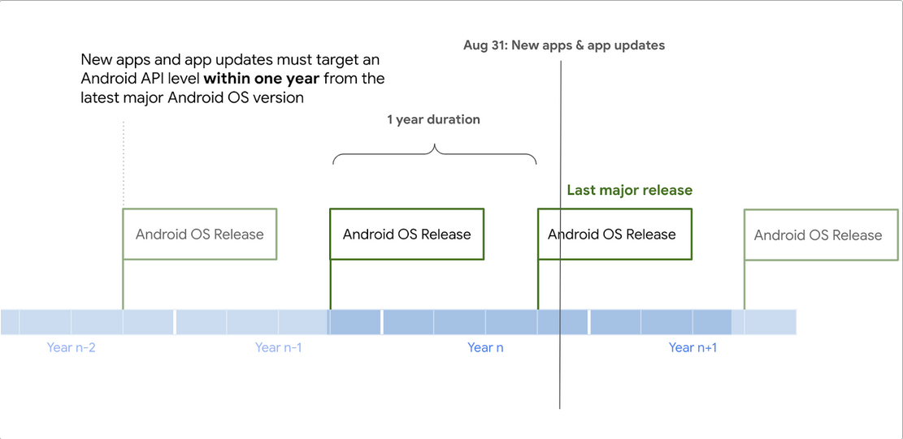
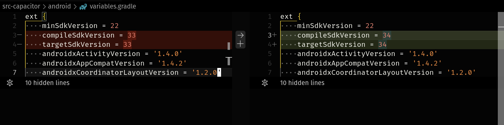
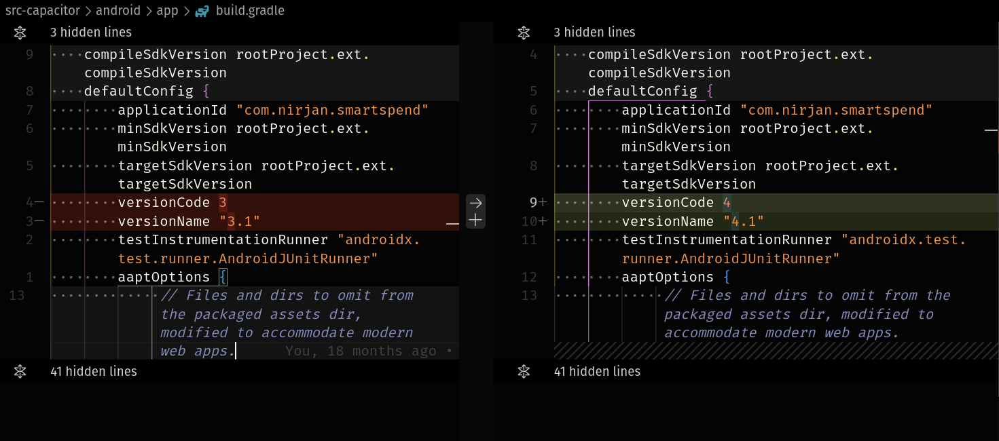

## What is the target API level requirements for Google Play
If you have an android app in the Google Play store, you need to make sure it's compatible with the latest version of android. The new version of android may have changes that could break your app. Likewise it could have new features that could help improve your app if you use them.

To make sure developers keep their apps updated with the new android version, Google Play requires new apps and app updates to target an API level within one year from the latest major Android OS version. You can read more about the details about the target API level requirements in the [google play documentation](https://support.google.com/googleplay/android-developer/answer/11926878?hl=en).

## How to update target API level for android apps using Capacitor

You can follow these steps to upgrade your target API level for your android app. I have tested it with my own app that is built using [Capacitor](https://capacitorjs.com/) and the [Quasar](https://quasar.dev/) framework so it should work for any apps built with that but it may not work for native Kotlin or Java apps. First, you will also need to make sure that you have android studio installed, you can follow the [instructions for that on the official android studio site](https://developer.android.com/studio/install).

	- Open you android app with android studio (for me that's in this folder: `src/src-capacitor/android`)
	- Android Studio might ask you to run some automatic upgrades but don't run them yet (you will most likely need to upgrade your capacitor version to get that to work)
	- Instead change the following files
		- `src-capacitor/android/variables.gradle`
			- change the **compileSdkVersion** and the **targetSdkVersion** to the one that you need
		
			- This will make sure you use the right target SDK when you build your app again
		- `src-capacitor/android/app/build.gradle`
			- Change your **versionCode** and **versionName** to something else
				- You can change it to whatever number you want (unless you're already following a versioning system) but it might make sense to just increment it by 1
				- We're changing this because otherwise you'll get a warning in the play console after uploading the build files saying that the version has already been used
				
		- Now, on android studio, run the app and just check if your app is still working as expected
		- If the app works then go to build > Generate Signed App bundle (if you're doing this for the first time or if you don't have your credentials saved then you'll need to follow some [extra steps documented here](https://developer.android.com/studio/publish/app-signing))
		- Then log into your google play console account and go to the releases overview section from the sidebar
		- You can go to the release dashboard from there and click the create new release button
		- Upload your android app bundle file, add a release name (you can name it anything but try to use a meaningful name, I used the android versionName from my build.gradle file), add the release notes (you can just say upgrading android SDK version or something like that).
		- Then submit the release for review
		- It should get reviewed fairly quickly (took less than 24hrs for me) and then you can update it on the app store and the issue should be resolved

This only covers updating the version numbers for the android build, you should still test your apps properly and you can choose to upgrade your capacitor version too. Let me know in the comments if this post was helpful or if you ran into another issue while following the steps.