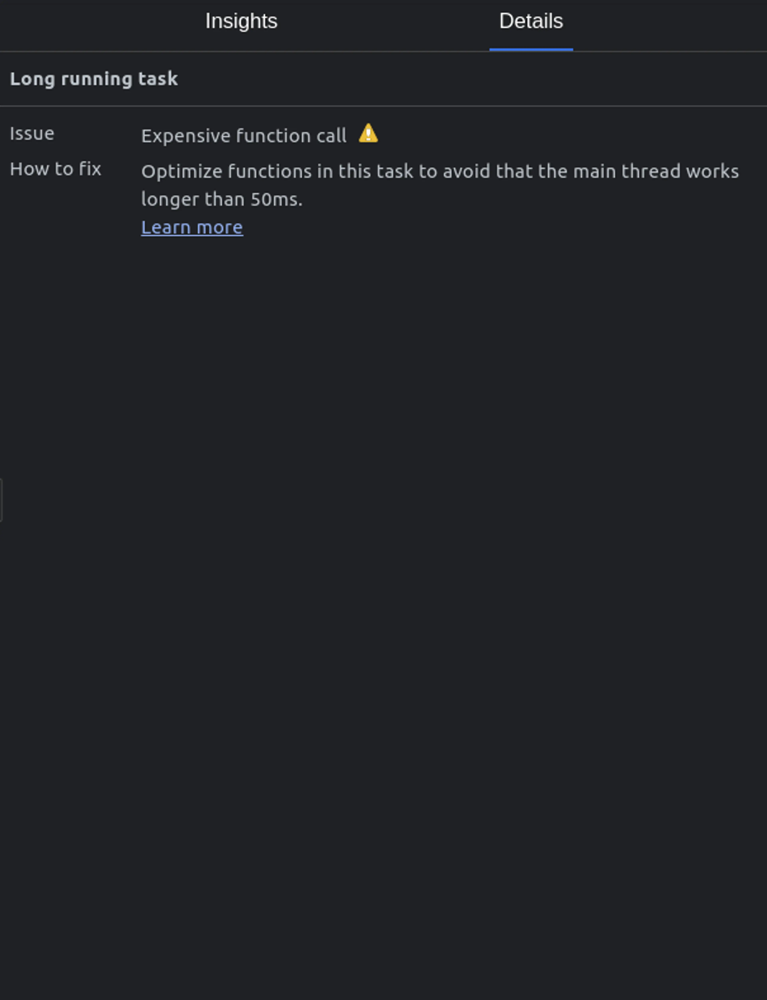

What causes poor JavaScript performance
---------------------------------------

First, let’s go over what leads to poor JavaScript performance. The most common causes of poor JavaScript performance are:

*   Large JavaScript files with lots of unused code that takes a long time to parse and execute
*   JavaScript Code that blocks the main thread for a long time
*   Blocking JavaScript code that gets called too often
*   Memory Leaks. If you’re using too much memory, the [Garbage Collector](https://developer.mozilla.org/en-US/docs/Web/JavaScript/Memory_management#garbage_collection) will run more often. This pauses the execution of your JavaScript and can cause a lag.

To figure out you can optimize your JavaScript code further, we need to do some performance tests. Then, we can make the right optimizations based on the results.

JavaScript Performance test for functions
-----------------------------------------

If you already know that you're calling a specific function a lot, then you should test the performance of it. Generally, you can use easy online tools to quickly check the performance of a function. Then, you can make some optimizations and recheck it.

My favourite tool to do this is [perf.link](https://perf.link/). You can check different functions at the same time, and it will show you how many times it can run in a second.

You can also use [jsbench.ch](http://jsben.ch/) or [jsbench.me](https://jsbench.me/) to test JavaScript performance, but [perf.link](http://perf.link/) is the easiest to use.

This is a good way to optimize performance bottlenecks. But how do you the performance bottlenecks in your app? This is where the browser DevTools come into play.

JavaScript Performance testing using DevTools
---------------------------------------------

You can use the DevTools in any browser to do performance tests. But, I’m going to use chrome for this post because it has the most in-depth measurement tools. Chrome recently added the [new performance insights panel](https://developer.chrome.com/docs/devtools/performance-insights/) which is easier to use than the old performance tab.

### Using the chrome performance insights panel

To open the chrome insights panel, first open the Dev Tools (Ctrl + Shift + I). If you don’t see the Performance Insights panel next to the other tabs (Elements, Network, etc), you can search for it using the command palette (Ctrl + Shift + P).

You can measure the page load performance with this or measure how quickly your app is responding to user interaction.

### Measuring Page Load Performance with the Performance Insights Panel

Before you measure the page load performance, you'll want to set up the throttling settings at the top. This allows you to simulate the page load for slower CPUs or slower network connections.

You can also add your own custom network throttling profile to make it closure to your user's network.

This [github gist contains the different profile settings for the different network connections.](https://gist.github.com/theodorosploumis/fd4086ee58369b68aea6b0782dc96a2e)

After setting up the CPU and network throttling, just click on the “Measure page load” button. This will automatically reload the page, start measuring the page load and stop when it’s done.

This will show you a recording of the page-load, with performance related events and insights on the right.

You can click on the insights like Long task, Layout shift, etc to learn more about the issues. It will give you a link to learn how you can fix those issues too.

This is especially helpful for you to debug issues related to Largest Contentful Paint (LCP) and Cumulative Layout Shift (CLS). These metrics are a part of Core Web Vitals. You can read more about them in my [guide to optimizing core web vitals](https://nirjan.dev/blog/how-to-improve-core-web-vitals-a-complete-guide-for-developers).

You can use this panel to figure out exactly which element is causing the most layout shifts. It will also tell you how much it’s impacting the CLS score. This will then allow you to locate the element in the DOM and prevent the shift from happening.

Additionally, You can click on the Largest Contentful Paint event to figure out which part of the LCP process is taking the longest. This will let you focus on the part that needs the most attention. It also gives you some helpful links to fix some of those issues.

Debugging common performance issues using DevTools
--------------------------------------------------

Besides using the Performance insights panel to debug Core Web Vitals issues, you can also use it to debug issues with network resources, long JavaScript tasks and unnecessary layout re-calculations.

### Debugging network issues

The network section can help you figure out what resources are loading, their loading time and their order. It shows all the request from when you start your test to the end.

If you click on the dropdown arrow next to network, you can toggle a view which shows the network requests grouped by the domain name. The insights panel can also show you all the render blocking requests.

When you hover over the render blocking request insight, it will highlight the request in the network section on the left. If you click on it, then it will give you more details like about the request. So, you can figure out why you’re making it and if you can avoid the request.

### Debugging Long JavaScript Tasks

You can use the performance insights panel to figure out how many long tasks are freezing your site’s UI. Since, JavaScript is single-threaded, if a script takes a long time to run, it will cause your site’s UI to freeze. So, you need to reduce synchronous long tasks as much as possible.

This panel can show you when long tasks are happening and how long the tasks are going on for. If you enable [source-maps](https://web.dev/source-maps/) for your sites, then it will also show you where the functions are in your codebase.

It will look like this when you have a source map enabled. This tool can also show you if the long tasks are happening on a third-party script.

Tips on using the performance insights panel
--------------------------------------------

Here are some tips on using the performance insights panel that will help you make the most out of it:

1.  Use network and CPU throttling
2.  Enable Source maps
3.  Run your tests in incognito mode without any extensions
4.  Only [enable the sections you’re focusing on](https://developer.chrome.com/docs/devtools/performance-insights/#settings)

Summary and tips
----------------

In summary, here are the main takeaways from this post:

*   Poor performance can be caused by various factors, such as unused code, memory leaks, and network issues.
*   JavaScript performance testing tools like [perf.link](https://perf.link) and the Performance Insights can help identify and fix these issues.
*   Best practices, such as minimizing file sizes and avoiding long-running tasks, can significantly improve the speed of JavaScript code.
*   The performance panel offers valuable insights into a website's performance, including load times and network activity.
*   By following these tips and utilizing performance testing tools, developers can create fast, responsive websites that provide an optimal user experience.

Tools like [perf.link](https://perf.link) and the [performance insights panel](https://developer.chrome.com/docs/devtools/performance-insights/) can be a great way to get started with measuring and debugging your JavaScript performance. But if you want to dive even deeper, then [the performance tab](https://www.thisdot.co/blog/performance-analysis-with-chrome-devtools) will give you even more data on what is impacting your performance. But, it is also more complicated to use, so you might not need it. Let me know in the comments if this helped you fix any JavaScript performance issues, and what do you think is the most frustrating part of debugging JavaScript performance?