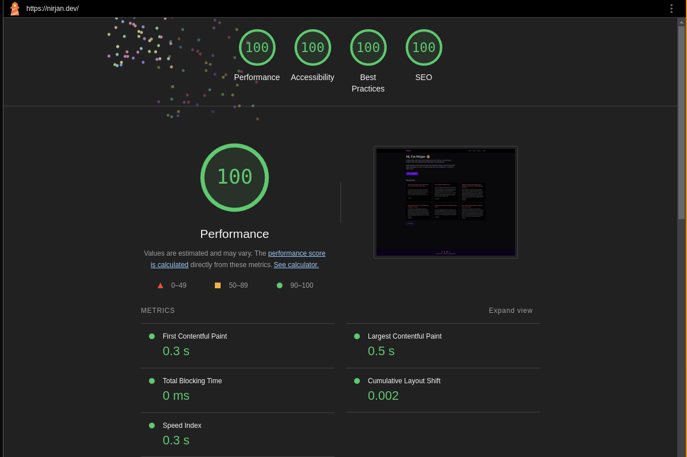
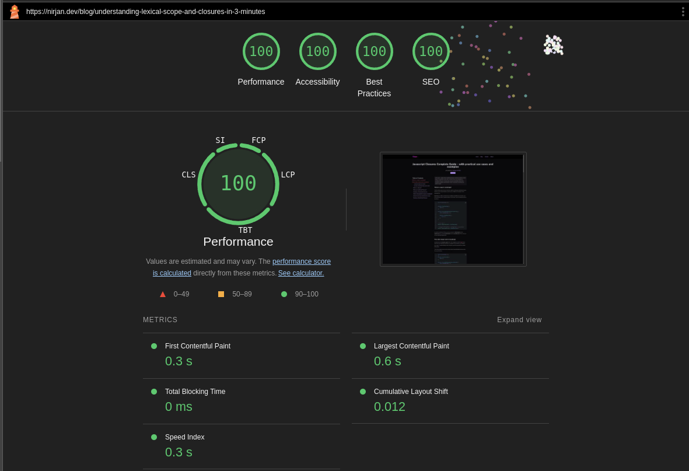

## The old tech stack with Next.js and Sanity

Over the years, I've migrated my sites to a few different frameworks. It all started with a Gatsby site, then I moved it to a Svelte static site generator called [Elder.js](https://github.com/Elderjs/elderjs) (which actually implemented the [islands architecture](https://www.patterns.dev/vanilla/islands-architecture/) before Astro), then finally to Next.js. I've also migrated my content from using markdown to [storyblok](https://www.storyblok.com/) CMS and then to [Sanity CMS](https://www.sanity.io/).

If I'm being honest, I haven't enjoyed working with Next.js that much. I mainly decided to use [Next.js](https://nextjs.org) for my site because it's by far the most popular meta-framework and uses [React](https://react.dev/) which is the most popular frontend framework. So, I thought If I used it for my personal site, I would be a better react developer and it would give me more opportunities professionally. But Ironically, I ended up joining a company that uses [Vue.js](https://vuejs.org/) and [Nuxt.js](https://nuxt.com/) and I've been working with that tech stack for the last 4 years 🤷‍♂️.

I don't necessarily hate React and I don't mind working in a React codebase but there are a lot more simpler alternatives. As I get more experienced, I'm appreciating simplicity more and more and leaning towards the simplest way to solve problems. 

So, as a part of rebuilding my site, I wanted to simplify my tech stack as much as possible. That meant picking a framework like Astro which has good support for templating without needing to use any other frontend frameworks (unless I want to) and moving back to using good old markdown instead of a CMS.

I also decided to get rid of my monorepo setup with [turborepo](https://turbo.build/repo/docs) which was definitely overkill for my personal site. I don't have any complicated linting rules or pre-commit hooks or auto-formatting either. You can still find the [Next.js version](https://github.com/nirjan-dev/nirjan.dev-next.js-version) and [the Elder.js version](https://github.com/nirjan-dev/nirjan.dev-elderjs) of the site on my Github.

## Why Astro?

Since the main goal of rebuilding my site was to make it simpler, Astro was a great fit for that. I also considered Nuxt.js which has a better developer experience but is probably overkill for a simple content focused site like mine. 

I wanted to move my content to markdown again too because I want to have complete control over my content, store it in a format that is extremely portable (in case I want to migrate to something else) and it also makes writing and editing simpler. Astro just happens to have great support for markdown with it's [content collections](https://docs.astro.build/en/guides/content-collections/) feature that lets you create a schema for markdown and query it like structured content.

Another selling point of Astro was the Island's architecture where everything is just HTML but I can have islands of interactive components on any part of the page. I really think this is the best way to build modern sites and even most web apps. 

The browser is great at rendering HTML so we should just shift towards that instead of trying to render everything with JavaScript. Even with Server Side Rendering, I think sites that hydrate and turn into client-rendered sites (most meta-frameworks like Next.js, Svelte, Nuxt, etc) are more brittle and less performant.

I've worked on a lot of content heavy sites with a framework that does this (Nuxt.js) and I definitely want to avoid going back to fully hydrated sites like that and deal with all the extra issues from hydration.

Moving towards sites that are just HTML with smaller isolated interactive components just makes the most sense to me. It let's us actually use the underlying web platform which is a lot more stable than most frameworks and is also way more performant and accessible. 

We also have a lot more lightweight alternatives to frontend frameworks, like HTMX, Alpine or just using web components to handle client-side interactivity. My thoughts on this might change as I build more projects with these technologies but for now I'm happy to embrace simplicity over the complexity of modern frontend frameworks.

## What I liked about astro

There's a lot of things to like about Astro. I've already mentioned the simplicity of Astro sites (they're mostly just HTML, CSS and some JavaScript if needed). But, the developer experience is also not that bad. It's basically just a framework that lets you create templates and organize them neatly into smaller components. All the Astro components are turned into regular HTML during the build process.

 It also has a lot of useful features to improve the performance, accessibility and SEO of your sites. It has a built-in image component that can help you optimize your images. It automatically does syntax highlighting for code blocks in your markdown which you can customize too.  
 
 There are first-party integrations for creating sitemaps and RSS feeds to improve your SEO. It includes a toolbar during development that can detect some accessibility and performance issues and flag it to you. It does CSS scoping for you automatically and has an official tailwind integration.

 The best selling point for Astro for a lot of people might actually be the support for multiple frameworks. It has official integrations for React, Preact, Svelte, Vue, Solid, Alpine and Lit. You can also just use a little vanilla JavaScript to add interactive Astro components too. It has some support for Server Side Rendering and Server APIs but I haven't used that part of it so far.

 It was a pretty good experience building with Astro and I really like how much they prioritize simplicity, performance, accessibility and using the web platform. I will most likely continue building a lot of my upcoming projects using Astro.

 ## What can astro improve
 I still think there are a few things that could be improved in Astro. Having come from the Nuxt.js ecosystem I might be a bit spoiled when it comes to enjoying a good developer experience. Astro is not the worst when it comes to developer experience (looking at you Next.js 👀) but it is nowhere near to the level of seamless integration that you get with the Nuxt.js devtools. 
 
 Astro has made a good start with their toolbar to detect accessibility and performance issues but I would love it if they added some features from the Nuxt devtools like the built-in routes and API explorer, bundling and compilation visualizations, open graph image previews, component inspectors and being able to browse and install integrations directly from the devtools.

I didn't use the server-side features of Astro in this project but looking at the documentation they seem to be missing a few things that the nitro server (which Nuxt.js uses) already supports. So, it would be great to see some support for things like Tasks, Cron jobs, built-in ORM (besides just Astro DB), caching and KV storage. The 3rd-party integrations can also be a bit hit and miss but that should start improving as more people start adopting Astro.

## Result of migrating from Next.js to Astro

Overall, I'm really happy with the move from Next.js to Astro and I look forward to working more with Astro on future projects. Here are the main things I learned by migrating my blog from Next.js to Astro
	- A framework that lets you incrementally add complexity and start from the simplest possible way of doing things feels great to use
	- Sites built with Astro will most likely always be better in terms of performance, accessibility and SEO than other meta-frameworks that need to do a full page hydration
	- You can use technologies that are closer to the web platform when using Astro compared to other frameworks. You can more easily adopt things like web components, smaller bits of vanilla JS logic, plain CSS HTML features. Of course, you can still use them with other frameworks but that's generally not the most common practice in those ecosystems.
	- Modern HTML and CSS has come a long way and is really good for common interactions. Features like the popover API, HTML Dialogs, HTML details and summary, CSS scroll transitions and the View transition API are enough to build a lot of rich modern client-side interactions without using additional JavaScript.
	- Astro might be the best solution for now if you value simplicity, performance and accessibility for your projects and want to stay in the JavaScript/Typescript ecosystem.
    - I still think there are some trade-offs to consider when using Astro, especially for highly dynamic apps or sites that require lots of server-side processing but in most cases Astro makes a lot of sense.
	- If I had to construct a Frankenstein's monster of a stack to fit all web projects it would probably have Astro's island's architecture, Nuxt's developer tooling, Laravel's first party packages, Go's simplicity and speed and Elixir's easy concurrency and scaling features but since I can't make something like that (yet), Astro's the framework to beat for now.
	- Astro sites are blazingly fast 🚀

