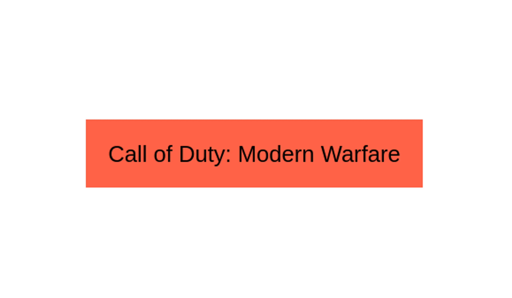
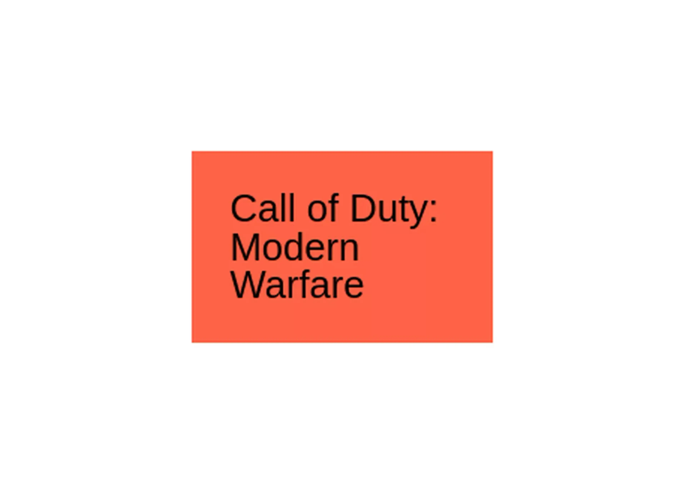
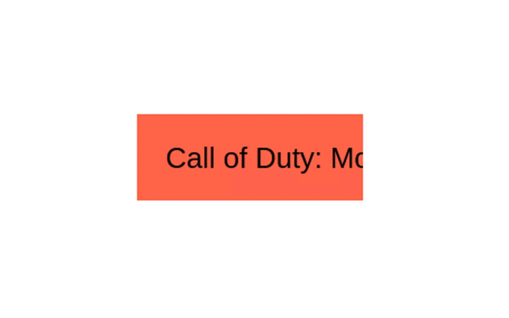
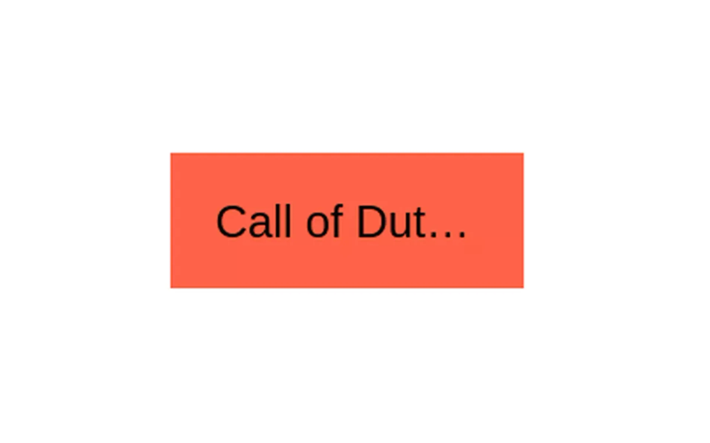

Text Truncate in CSS
--------------------

Truncated or shortened text is most common when you're working on a design with equal-height columns. But generally, the text for those columns is dynamic. I had to work on a design like that at work recently.


The category names like Mario, Nintendo, Call of Duty: Modern Warfare, etc need to be in a single line. If it doesn't fit, then I need to truncate it. I also need to truncate the title of the article to 4 lines. So, for this specific layout, I had to do CSS text truncate for both a single line and multiple lines.

How to do CSS text truncate?
----------------------------

Let's start off with a single line CSS text truncate with a “p” tag. You can follow along with me using this snippet. Here's the link to the [finished codepen](https://codepen.io/nirjan_dev/pen/GRWYQMr) if you want to copy it from there.

```html
<p class="single-truncate">
  Call of Duty: Modern Warfare
</p>
```

```css
/* global styles */
body {
  min-height: 100vh;
  display: grid;
  place-items: center;
  gap: 0.8em;
  font-family: Arial,Helvetica Neue,Helvetica,sans-serif;
  font-size: 1.6rem;
}

p {
  background: tomato;
  padding: 1em;
}
```




Here are the steps you need to follow to truncate this text.

### 1\. Setting fixed width with CSS

You need to set a width on the element that you are targetting. So, the browser knows how long the text should be before you truncate it.
```css
/* truncate stuff */
.single-truncate {
  width: 150px;
}
```    



### 2\. Using the white-space property in CSS

To avoid wrapping the text to the next line, we need to set the [white-space property](https://developer.mozilla.org/en-US/docs/Web/CSS/white-space) to nowrap.
```css
.single-truncate {
  width: 150px;
  white-space: nowrap;
}

```


### 3\. Using the overflow CSS property

Next, you need to set the overflow property to hidden. This hides the text when it goes beyond it's width.
```css
.single-truncate {
  width: 150px;
  white-space: nowrap;
  overflow: hidden;
}
```



### 4\. CSS truncate with ellipsis

We have successfully truncated the text. But it would be nice to have some sort of indication that we have truncated it. Let's add ellipses to the end of the shortened text. We can do this by setting the text-overflow property to ellipsis.
```css
.single-truncate {
  width: 150px;
  white-space: nowrap;
  overflow: hidden;
  text-overflow: ellipsis;
}
```



> All you need to remember is 4 CSS properties. Width, white-space, overflow, text-overflow or remember the acronym, **WWOT**. You can use "We Won't Overflow Text” as a mnemonic. You can probably come up with something better.

How do you truncate multiple lines with CSS?
--------------------------------------------

Truncating text for multiple lines is a bit more tricky. Let's start with a simple “p” tag again, but with some more text this time and make it wider.
```html
 <p class="multiple-truncate">
    Nintendo E3 2021: Direct Dates and Time, Predictions, Rumours and Zelda Plans 
 </p>
 ```

 ```css
 .multiple-truncate {
   width: 250px;
 }
``` 


Right now, the text has 5 lines. Let's see if we can truncate it to just 4 lines.

### How to use line clamp in CSS

This property only works if you set the [display](https://developer.mozilla.org/en-US/docs/Web/CSS/display) property to -webkit-box or -webkit-inline-box. Also, the [\-webkit-box-orient](https://developer.mozilla.org/en-US/docs/Web/CSS/box-orient) property needs to be set to vertical.

> **Note**: This property was originally implemented in WebKit and has some issues. It got standardized for legacy support.

> When applied to anchor elements, the truncating can happen in the middle of the text, not necessarily at the end.

Now, let's add the new rules to our multiple-truncate class and see what will happen.
```css
  .multiple-truncate {
    width: 250px;

  /* truncates text   */
  -webkit-line-clamp: 4;
  display: -webkit-box;
  -webkit-box-orient: vertical;
}
```


It's not quite what we were looking for. The problem with this approach is that we won't be able to have a padding-bottom on the actual text. Otherwise, the space occupied by the bottom padding will show the truncated text. So, let's remove the bottom padding for now.
```css
.multiple-truncate {
  width: 250px;
  
  /* truncates text   */
  -webkit-line-clamp: 4;
  display: -webkit-box;
  -webkit-box-orient: vertical;
  padding-bottom: 0;
}

```
Then we need to hide the truncated text by setting the overflow to hidden.
```css
.multiple-truncate {
  width: 250px; 

 /* truncates text   */
  -webkit-line-clamp: 4;
  display: -webkit-box;
  -webkit-box-orient: vertical;
  padding-bottom: 0;
  overflow: hidden;
}
```    

The downside to this approach is that you can't have a padding-bottom on the text. You would need to add your padding to the parent or try something else.

One thing you can try is to set a border on an "after" pseudo-element. The border-color should be the same as the background for the text. Then, you need to set the border-width to the padding-bottom value you want. You can use an SCSS mixin or CSS variables for this to make it more robust and reusable.
```css
.multiple-truncate:after {
  content: '';
  display: block;
  border-bottom: 1em solid tomato;
}
```    


Truncate text with flexbox
--------------------------

> Truncating text like this doesn't work well if the element you're truncating has a display value of flex or inline-flex.

The text will still be shortened but you won't get the ellipsis at the end. I'm not sure why it happens or if there are any workarounds for this. If you have any ideas, then let me know in the comments below.

Truncate text with SCSS
-----------------------

Here are two SCSS mixins that will make truncating text easier.
```scss
@mixin truncate-single-line($width) {
  width: $width;
  white-space: nowrap;
  overflow: hidden;
  text-overflow: ellipsis;
}

@mixin truncate-multiple-lines($width, $lines, $paddingBottom: false, $bg) {
  width: $width;
  -webkit-line-clamp: $lines;
  display: -webkit-box;
  -webkit-box-orient: vertical;
  overflow: hidden;
  padding-bottom: 0;
  
  @if $paddingBottom {
    &:after {
    content: '';
    display: block;
      border-bottom-width: $paddingBottom;
      border-bottom-style: solid;
      border-bottom-color: $bg;
    }
  }
}
```

You can even use CSS variables for the **$paddingBottom** argument and then use media queries to make it responsive without changing the mixin.
```scss
.multiple-truncate--with-mixin {
  --pd: 1em;
 padding: var(--pd);
  @include truncate-multiple-lines($width: 250px, $lines: 4, $bg: tomato, $paddingBottom: var(--pd));
  
 @media (max-width: 600px) {
    --pd: 0.2em;
  }
}
```
Summary on CSS truncate text
----------------------------

Here's a quick summary of how to do text truncation with CSS:

*   Truncated or shortened text is commonly used in designs with equal-height columns where the text is dynamic.
*   To truncate text in CSS, you can use the following steps:
    1.  Set a fixed width on the element you are targeting.
    2.  Use the white-space property and set it to 'nowrap' to avoid wrapping the text to the next line.
    3.  Use the overflow property and set it to 'hidden' to hide the text when it goes beyond its width.
    4.  Use the text-overflow property and set it to 'ellipsis' to add an indication that the text has been truncated.
*   Truncating text for multiple lines is more tricky, but can be done by setting a fixed height on the element, using the display property and setting it to '-webkit-box' and '-webkit-line-clamp' and setting the number of lines to be displayed.

How has your experience been with truncating text in CSS? What techniques have you tried? Do you know any other ways to do this? Let me know in the comments below. I hope this was a helpful article.
