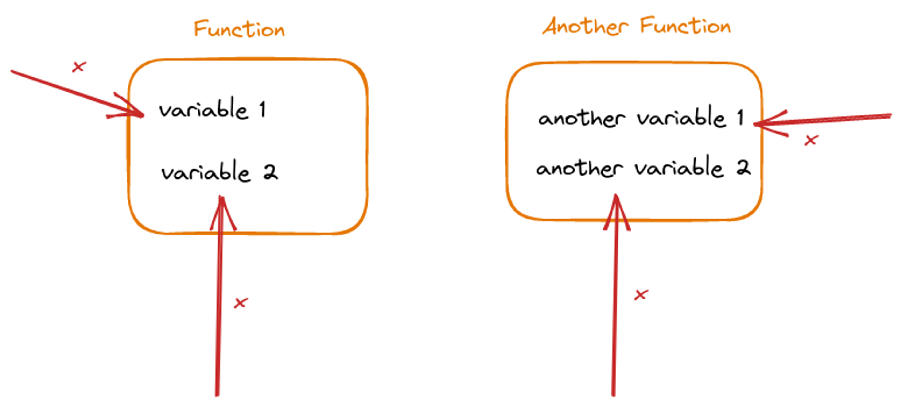

What is scope in JavaScript?
----------------------------

We first need to know what we mean by scope to understand a JavaScript Closure. Scope is a set of rules that tell you where your variables and functions can be accessed from.

Depending on where you have set your variables and defined your functions, you can only access them in specific sections of your code. Here is an example of that in JavaScript.
```js
const firstVariable = 1;


function firstFunction() {
    return 2;
}

function functionWithAnotherFunctionInside() {    
    const secondVariable = 2;
    
    function secondFunction() {
        return 3;
    }
}


// will log 1 2
console.log(firstVariable, firstFunction()) 

// Uncaught ReferenceError: secondVariable is not defined
console.log(secondVariable, secondFunction())
    ``` 

So what's the deal here? Why can can we access the _**firstVariable**_ and the **_firstFunction_** but not the **_secondVariable_** and the **_secondFunction_** ? This is because of how JavaScript Scope works.

How does Scope work in JavaScript
---------------------------------

JavaScript only had **function scope** (with a few exceptions) until the [ES6](https://www.programiz.com/javascript/ES6) version came out. This meant that, whenever you defined a new function, you created a new scope. A variable defined inside a function cannot be accessed from outside the function.

This is why we get an error when trying to log the secondVariable value and call the secondFunction.
```js
const firstVariable = 1;
]
function firstFunction() {
    return 2;
}

function functionWithAnotherFunctionInside() {    
    const secondVariable = 2;
    
    function secondFunction() {
        return 3;
    }
}


// will log 1 2
console.log(firstVariable, firstFunction()) 

// Uncaught ReferenceError: secondVariable is not defined
console.log(secondVariable, secondFunction()) 
```
> Scope won't let you access the variables that are set inside a function from the outside.



### JavaScript Scopes are nested

The inner scope has access to the outer scope, but the outer scope can't access the variables set in the inner scope.
```js
function outerFunction() {
  let i = 777;
  console.log(i); // 777
  console.log(b); // Refference Error (outer scope can't access variables in inner scope)

  function innerFunction() {
    console.log(i); // 777 (inner scope can access the enclosing outer scope)
    let b = "hello";
  }

  innerFunction();
}
outerFunction();

```
> Scope consists of a series of bubbles that each act as a container or bucket in which identifiers are declared , these bubbles nest inside each other and this nesting is defined at author time.  
> [Kyle Simpson](https://twitter.com/getify) (Author of the [You Don't know JS series](https://github.com/getify/You-Dont-Know-JS))


```js
//global scope
var i = 666;
console.log(i); // 666

function foo() {
  // scope of foo
  var i = 777;
  console.log(i); // 777
}

foo();

```
### How does JavaScript Scope work in ES6

ES6 introduced two new ways to declare variables; using let and const. They can be used for block scoping. Whenever you use let or const to declare variables, they are scoped to the block (any code surrounded by a pair of curly brackets). ES6 also introduced another scope with modules, but closures work in the same way in modules too, so we don't have to dive deep into that. If you are curious, here's the [MDN link to JavaScript modules](https://developer.mozilla.org/en-US/docs/Web/JavaScript/Guide/Modules).
```js
//global scope
var i = 666;
console.log(i); // 666

{
  // new block scope
  // you'l see these types of blocks used with if,else,for,while,etc
  let i = 777;
  console.log(i); // 777
}

```
> _**note:** You might have heard the term **lexical scope** in JavaScript which is just a technical term for scope that is defined during the code compilation process called lexing. It basically means that scope is defined when you are writing the code (declaring functions, or blocks), instead of when it is actually executed by the computer._

What is a Closure?
------------------

A closure is a programming technique for allowing functions to access values that are defined outside of it. It is the combination of a function bundled together with variables that are outside of it.

> You have a closure when a function accesses variables defined outside of it.


What are JavaScript Closures?
-----------------------------

In JavaScript, because scope is nested, it is actually pretty easy to create a closure.
```js
let usernames = ['John', 'Jack', 'James', 'Jhonny'];
let searchTerm = 'Ja';

// Here the function is accessing the searchTerm variable which is outside the function
// this is a closure
let filteredUsernames = usersnames.filter(function (username) { 
    return username.startsWith(searchTerm)
  });

```
Since, functions can be nested, you can also use closures with nested functions like this:
```js
function outerFunction() {
  let a = 666;
  function innerFunction() {
    console.log(a);
  }
  return innerFunction;
}
let myFunc = foo(); // now myFunc is just a reference to innerFunction inside the outerFunction.

myFunc(); // 666;
```
When the outer function runs, the 'a' variable is set to 666. So, You might expect the 'a' variable to not be available afterwards when the function has finished running.

Since scope can be nested, the inner function still has access to the 'a' variable. So, as long as some part of the code can still call the inner function, it can still remember the 'a' variable.

Closures can cause functions to remember variables within their scope.

> With a Closure, you are combining a function with the data that it can access outside of it.

## Examples of JavaScript Closures

Closures are useful to combine a function with some internal value that it should use. This might be familiar if you have some experience with [object-oriented programming and encapsulation](https://press.rebus.community/programmingfundamentals/chapter/encapsulation/).
```js
function getClickCountUpdater() {
  let counter = 0;
  return function() {
    counter = counter + 1;
    console.log(counter);
  };
}

const updateClickCounter = getClickCountUpdater();

// now to change the counter, you need to use this function, you can't change it directly
updateClickCounter(); // 1;
updateClickCounter(); // 2;

counter = counter+1; // ReferenceError: counter is not defined
console.log(counter); // ReferenceError: counter is not defined

// You can create another count updater function which will have a seprate counter variable in it's scope
const anotherCounter = getClickCounUpdater();
anotherCounter(); // 1;
```
They can also be useful for creating different variations of a function, and to keep track of some value inside a function that shouldn't be changed from anywhere else. This is pretty useful when you want to do some logging for a specific function like this:
```js
function createAd(width, height) {
  let adCounter = 0;
  return function (link) {
    adCounter++;
    console.log(`${width}x${height} ad created ${adCounter} times!`);
    return {
      _type: 'ad',
      link: link,
      width: width,
      height: height,
      // other generic ad options
    }
  }
}

const create300x250Ad = createAd(300, 250);
const create728x90Ad = createAd(720, 90);

// 300x250 ad created 1 times!
const new300x250Ad = create300x250Ad('https://linkToTheAd.com/path');

// 300x250 ad created 2 times!
const another300x250Ad = create300x250Ad('https://linkToTheAd.com/path');
```
## What is the benefit of closure in JavaScript?

JavaScript Closures can also be used to do some performance optimization. Let's say you have a function that needs to set a variable, but that variable takes up a lot of memory. Instead of creating that variable each time you run the function, you could use a closure to reuse it.
```js
function findAdLinkById(id) {
  const adMap = {
    'e645-2456': 'https://link.com/path',
    '2282-3238': 'https://another-link.com/another-path',
    // 1000 more items
    
    '2901-2192': 'https://one-more-link.com/path'
  }
  return adMap[id]
} 

// whenever this function gets called it needs to store a new adMap value in memory which makes calling this function slower the more we call it
const firstAd = findAdLinkById('e645-2456')
const secondAd = findAdLinkById('2282-3238')
const thirdAd = findAdLinkById('2901-2192
function createFindAdLinkById() {
  const adMap = {
    'e645-2456': 'https://link.com/path',
    '2282-3238': 'https://another-link.com/another-path',
    // 1000 more items
    
    '2901-2192': 'https://one-more-link.com/path'
  }
  return (id) => adMap[id]
} 
const findAdLinkById = createFindAdLinkById()

// whenever this function gets called it reuses the same adMap value which makes it faster to run
const firstAd = findAdLinkById('e645-2456')
const secondAd = findAdLinkById('2282-3238')
const thirdAd = findAdLinkById('2901-2192')
```
> Note: while this will be more performant, it will also use more memory. So, if you also need to optimize the memory consumption then you should try something else.

One of the most common use cases of JavaScript Closures is with [asynchronous JavaScript](https://developer.mozilla.org/en-US/docs/Learn/JavaScript/Asynchronous).
```js
let id = 1;

getUserFromAPI(id).then(response => {
  // this works because the function callback here can still remember the value of the id even though this code won't run immediately
  console.log(`Fetched user ID: ${id}`)
})

```
Most of the time, you might not even realize when you're using a closure. Basically, anytime you're using a variable that is outside a function from inside the function, you are using a closure.

So, These are some practical use cases for JavaScript Closures:

*   Limiting the access to certain variables
*   Limiting the access to call certain functions
*   Keeping track of values across function calls
*   Logging function calls
*   Optimizing the memory usage of function calls
*   Creating different variations of the same function
*   Remembering values with asynchronous functions that get executed later

Closures can cause performance issues
-------------------------------------

While closures can be pretty useful when you use them intentionally. Sometimes they can also lead to memory issues, because closures are stored in memory. If we create unnecessary closures frequently, then it can cause a memory leak.

We need to make sure we're actually using the variables that are being stored in the memory. We should not create unnecessary closures too much. Let's take a look at our example from earlier to see how closures can cause too much memory usage.
```js
function createFindAdLinkById() {
  const adMap = {
    'e645-2456': 'https://link.com/path',
    '2282-3238': 'https://another-link.com/another-path',
    // 1000 more items
    
    '2901-2192': 'https://one-more-link.com/path'
  }
  return (id) => adMap[id]
} 


// now instead of having just one closure, we have 2000 closures
for (let i = 0; i <= 2000; i++) {
  const findAdLinkById = createFindAdLinkById()
  const firstAd = findAdLinkById('e645-2456')
  const secondAd = findAdLinkById('2282-3238')
  const thirdAd = findAdLinkById('2901-2192')
}
   ``` 
    
    
    

So, Whenever you are creating closures, you need to be aware of how much memory you are actually using.


Summary of JavaScript Closures
------------------------------

I hope you now have a better understanding of JavaScript Closures. Here's what was covered in this post:

*   Scope is a set of rules that determine where variables and functions can be accessed in code.
*   Until ES6, only function scope was available in JavaScript, meaning variables defined within a function could not be accessed from outside.
*   ES6 introduced block scoping with the “let” and “const” keywords.
*   JavaScript's scope is nested, with inner scopes having access to outer scopes but not vice versa.
*   “Lexical scope” refers to scope that is defined during the code compilation process, rather than when the code is executed.
*   Closures are functions that have access to variables in their parent scope even after the parent function has returned.
*   Closure allows a function to remember the environment in which it was created, even after it leaves that environment.
*   Closures can be used to create private variables and methods, by returning inner function from outer function.
*   Closures can also be used to make performance optimizations.
*   You should use closures carefully if you want to make your apps more memory efficient.
