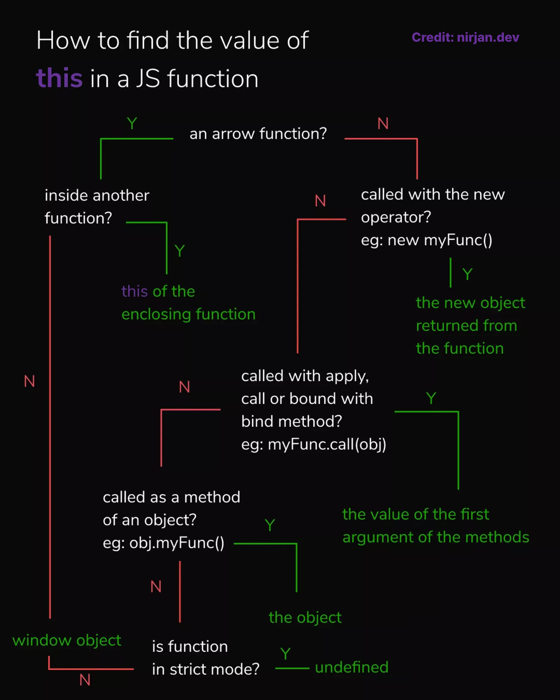

This post will help you figure out how you can easily find out the value of “this” in JavaScript. If you're in a hurry, there's a JavaScript this keyword cheat sheet at the end.

The keyword **“**this**”** in JavaScript has confused a lot of developers, but with just 4 simple rules, you will never be confused again.

First, you need to know one important thing when working with the “this” keyword -

> _**this** is not author-time binding but runtime binding so it's not about where a function is declared but how it's called_

When I talk about **“this bindings”,** I simply mean, how the “this” keyword is given a value. In JavaScript, there are 4 different types of “this” bindings, and they have their own order of precedence. So here are the 4 different “this” bindings in ascending order of precedence.

How the “this” keyword works in JavaScript — Default Binding
------------------------------------------------------------

Most of the function calls in your code will have the default binding. The value of this is bound to the global object (the window object when working with JavaScript in the browser). This happens when you call a function with just the function name and it's arguments within brackets.

> _**Note**: If the function is in strict mode, then by default **“this”** refers to undefined. When working in a JavaScript module, [strict mode is enabled automatically.](https://developer.mozilla.org/en-US/docs/Web/JavaScript/Reference/Strict_mode#strict_mode_for_modules)_
```js
function foo() {
  this.a = 4;
  /**
   *   creates a global variable a
   *    this is the same as doing these things
   *    var a = 4;
   *    or window.a = 4;
   **/
}

foo();
console.log(a); // 4

function bar() {
  "use strict";
  /**
   * since this is undefined in strict mode
   * the a variable cannot be set and it
   * results in an error
   */

  this.a = 6;
  console.log(a);
}
bar(); // TypeError: Cannot set property 'a' of undefined
```
**What is the “this” keyword in a JavaScript class – Class Binding**
--------------------------------------------------------------------

This type of binding happens when you call a function as a method of an object. The value of **this** is the object itself.
```js
obj = {
  a: 4,
  foo: function() {
    console.log(this.a);
  }
};
obj.foo(); // 4
```
It does not matter where you declare the function, as long as you call it as a method of the object.
```js
function foo() {
  console.log(this.a);
}

obj = {
  a: 7,
  foo: foo
};

obj.foo(); // 7
```
Only the top/last level of an object property reference chain matters.
```js
function foo() {
  console.log(this.a);
}
const obj1 = {
  a: 4,
  foo: foo
};
const obj2 = {
  a: 7,
  obj1: obj1
};
obj2.obj1.foo(); // 4

/*
Here, obj2 is accessing it's obj1 property 
and then since, the obj1 property is an object itself, 
it calls it's own foo method,
which accesses the a variable set in the obj1 object so it logs the value 4.
*/
```
The most important thing to remember is that, it's not about the function itself. It's about how it is called. For example, here we call the foo function but since it is not called as a method of an object, we fall back to the default binding of “this”.
```js
function foo() {
  console.log(this.a);
}

const obj = {
  a: 7,
  foo: foo
};

/**
 *  only a reference to the actual function is assigned
 * it does not care about the implicit binding
 */
const bar = obj.foo;

var a = 11;

/**
 * here this refers to the window object because of
 * default binding
 **/
bar(); // 11
```
**How to bind this in JavaScript – Explicit Binding with call and apply**
-------------------------------------------------------------------------

Most of the built-in functions and all user-defined functions have two special utility methods; apply and call. You can use these methods to explicitly bind the value of this. The value of “this” is easy to figure out because it is explicitly passed in as the first argument to the call or apply methods.
```js
function foo() {
  console.log(this.a);
}

const obj = {
  a: 4
};

/**
 * calls the foo function
 * where this is bound to the obj object
 */
foo.call(obj); // 4
```
> _**Note**: apply and call both works the same for explicitly binding “this” to a given value, but the way they [pass in other arguments is a little different](https://developer.mozilla.org/en-US/docs/Web/JavaScript/Reference/Global_Objects/Function/apply). You may have also used the .bind() es6 method before which uses explicit binding under the hood, you can [read more about it here](https://developer.mozilla.org/en-US/docs/Web/JavaScript/Reference/Global_Objects/Function/bind)._

**How this works in JavaScript with the new keyword – new binding**
-------------------------------------------------------------------

To understand this type of binding, you need to understand how constructors work in JavaScript. In JavaScript, constructors are just functions that are called with the “new” operator in front of them. They are not attached to classes, nor are they instantiating a class. They are just regular functions hijacked by the use of the “new” keyword.

Any user-defined or built-in function can be called with a “new” in front of it, and that makes it a construction call. There is no such thing as constructor functions, but rather construction calls of functions.

These things happen when you make a construction call:

1.  A brand-new object is created.
2.  The new object is prototype linked.
3.  The object is set as the “this” binding for the function call
4.  Unless the function returns its own alternate object, the new invoked function call will return the newly constructed object.
```js
function foo() {
  this.a = 4;
}
const bar = new foo(); // bar is set to the newly created object;
console.log(bar.a); // 4
```
**How this works in an arrow function – Arrow function binding**
----------------------------------------------------------------

I know I promised there were only 4 different types of **“this”** binding and in the past, that was true, until es6 which introduced arrow functions.
```js
/**
 *  arrow functions use the fat arrow =>
 * instead of the function keyword.
 */

a => {
  console.log(a);
};
```    

Arrow functions are not just a quicker way to write functions, but they also do “this” binding a little different. They use **lexical scope** for “this”. To learn more about lexical scope, check out my [guide to lexical scope and closure](https://nirjan.dev/blog/understanding-lexical-scope-and-closures-in-3-minutes).

They inherit the value of **“this”** from their outer function. By “outer function”, I mean the function where you declare the arrow function, not where you call them.
```js
function foo() {
  var = 3;
  return () => {
    /**
     * here this actually refers to the
     * this of the foo function
     */

    console.log(this.a); // 3
  };
}

```

Here's a more complicated example, that uses the other ways to bind “this” alongside the arrow function binding.
```js
function foo() {
  return () => {
    /**
     * here this actually refers to the
     * this of the foo function
     */

    console.log(this.a);
  };
}
const obj1 = {
  a: 4
};
const obj2 = {
  a: 7
};

/**
 * sets "this" binding to obj1 and
 * gets the arrow function as the return value
 * Now bar is a reference to the arrow function returned by the foo function
* */
const bar = foo.call(obj1);


/**
 * tries to set the this binding
 * of the arrow function to obj2 but
 * the arrow function's this is set
 * to the this of foo which was bound to obj1
 **/
bar.call(obj2); // 4
```
Therefore, the **“this”** binding of arrow function is actually done in author-time rather than runtime like the other types of **“this”** binding.

  
"this" in JavaScript Summary and Cheat sheet
-----------------------------------------------

Here are the things we now know about how "this" works in JavaScript:

*   The "this" keyword in JavaScript is not author-time binding but runtime binding, meaning it's not about where a function is declared but how it's called
*   There are 4 different types of “this” bindings in JavaScript, each with its own order of precedence:
    1.  Default Binding: the value of this is bound to the global object (the window object when working with JavaScript in the browser). If the function is in strict mode, then "this" refers to undefined.
    2.  Class Binding: the value of this is the object itself when calling a function as a method of an object.
    3.  Explicit Binding with call and apply: allows you to explicitly bind the value of this by passing the desired value as the first argument to the call or apply method.
    4.  Implicit Binding: the value of this is the object that the function is a property of.
*   The most important thing to remember is that it's not about the function itself, it's about how it's called.
*   Arrow functions in JavaScript do not have their own "this" binding, they inherit the “this” value of the surrounding scope. This means that the value of "this" inside an arrow function will be the same as the value of "this" in the code that surrounds the arrow function.
    
    You can use this cheat sheet to help you find the value of **“this”** in JavaScript. So, next time when it's hard to debug the value of” **this”** just remain calm and ask yourself these questions.
    

